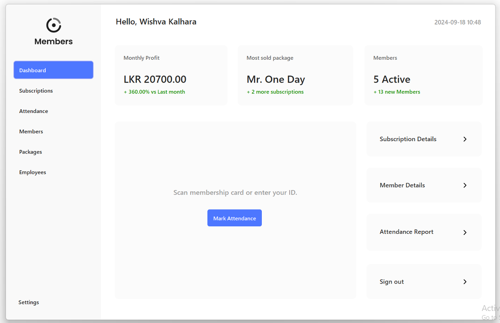
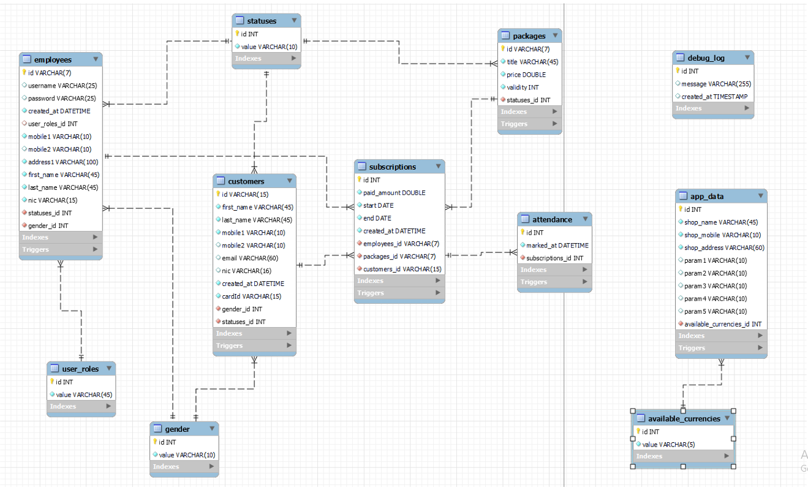

# Membership Management System

The Membership Management System is a Java Swing-based desktop application designed to streamline and manage memberships for businesses.

The system includes functionality for managing members, subscriptions, packages, employees, and attendance. It caters to three key actors: Business Admin/Owner, Front Desk Personnel, and Registered Members, each with specific roles and permissions.

-   [📃 Project Docs](https://drive.google.com/file/d/15uRPXzvG9TnXLSdyzpTpYAJhTpsFiMTm/view?usp=sharing)
-   [🔨 Triggers Docs](https://github.com/vishva-kalhara/Members-v2/blob/master/docs/triggers.md)
-   [📖 Stored Procedures Docs](https://github.com/vishva-kalhara/Members-v2/blob/master/docs/stored_procedures.md)

# Technologies Used

-   `Java Swing` for the user interface.
-   `MySQL` for database management.
-   `SQL` for triggers, stored procedures and query data.
-   `JasperReports` for generating printable reports.
-   `MVC Architecture` to ensure separation of concerns.
-   `Multithreading` for operations like lazy data loading.
-   `GitHub` for version controlling.

# Features

### Admin/Owner:

-   Insert, update, or delete employee records.
-   Manage packages (insert, update, delete).
-   View and filter data for members, subscriptions, employees, and packages.
-   Generate reports to view and print data for packages, members, - subscriptions, and employees.
-   Update shop details.
-   View analytics, such as:
    -   Monthly profits.
    -   Most sold package statistics.
    -   Membership statistics.
-   Sign in to the system securely.

### Front Desk Personnel:

-   Insert new member records.
-   Issue subscriptions to members.
-   View, print, and filter subscription data.
-   Sign in to the system securely.

### Registered Members:

-   Mark attendance through the system.

# EER Diagram

# Use Case Diagrams

The system includes distinct use case diagrams for each actor, clearly showing their interactions with the application (refer to the attached images for details).

# License

Queue Up is an Open Source SaaS. [Licensed as MIT](https://github.com/vishva-kalhara/Members-v2/blob/master/LICENSE)

# Contribution

Contributions are welcome! Please fork the repository and submit a pull request for any new features or bug fixes.
